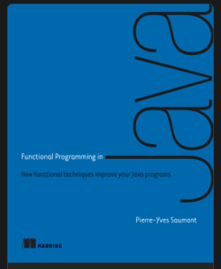

# funcProgJava
Working through [Functional Programming in Java](https://www.manning.com/books/functional-programming-in-java) book



### Notes

#### Chapter 5 - persistent list

`foldRight` => `foldLeft` followed by `reverse`

#### Chapter 6 - Maybe

`traverse` and `sequence` are dual/inverse: one can be derived using the other as "primitive".

```java
// `sequence` as "primitive"
static <A, B> Maybe<PList<B>> traverse(PList<A> xs, Function<A, Maybe<B>> f) {
    return sequence(xs.map(f));
}

// conversely, with `traverse` as "primitive"
static <A> Maybe<PList<A>> sequence(PList<Maybe<A>> xs) {
    return traverse(xs, Function.identity());
}
```
